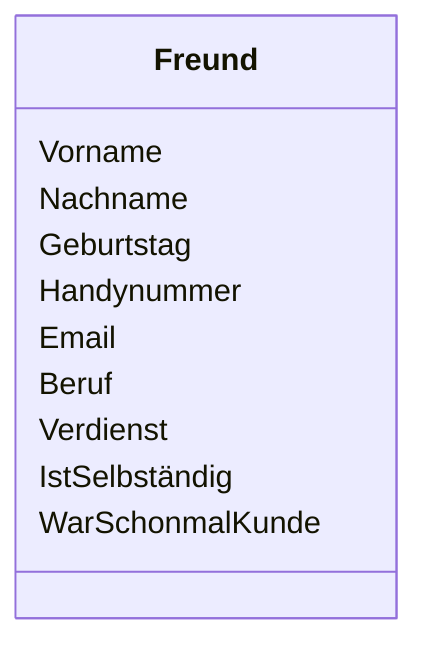

# ✅ Aufgabenstellung

Seit dem du Webentwickler bist lernst du immer neue Freunde kennen. Nun bist du aber auch ein Geschäftsmensch. Du willst also gleich sehen wie gut du an deinen neuen Freunden verdienen kannst und ob du sogar schon was für die gemacht hast.

Schreibe eine API mit der du deine Freunde verwalten kannst.

Also standard CRUD operationen für Freunde Entitäten.

Deine Freunde sollen folgende Properties haben.

Bitte entscheide selber welche Datentypen die passenden sind.

Neben den standard Queries wollen wir noch ein paar spezifische Queries haben:

1. Nur Freunde mit einen Verdienst über xxx
2. Nur Freunde die Selbständig sind.
3. Nur Freunde die älter als xxx sind.
4. Nur Freunde die schonmal Kunde waren und über xxx Verdienen
5. Alle Freunde sortiert nach dem Verdienst

Vergiss nicht das Freundschaften nicht ewig halten, also solltest du auch Freunde entfernen können.

Genauso entwickeln sich alle Menschen weiter, schaue wie du deine Entitäten updaten kannst.

## Zusatz:

Die Freunde sollen Kategorisiert werden können und natürlich danach gefiltert werden. 

Die beziehung soll in eine "onToMany" -> "ManyToOne" Beziehung eingebunden werden

## neue funktionen sind:
1. Neue Kategorie erstellen.
2. Freunde zu einer Kategorie hinzufügen.
3. Freunde von der Kategorie entfernen.
4. Kategorie Löschen
5. Freunde nach Kategorie filtern. 

- Beim hinzufügen und beim entfernen einer Ressource in der Beziehung wird automatisch auch die andere seite bearbeitet. 
- beim Löschen der Kategorie werden alle damit verbundene Freunde angepasst (Der Kategorie speicher wird auf "null" gesetzt). 

